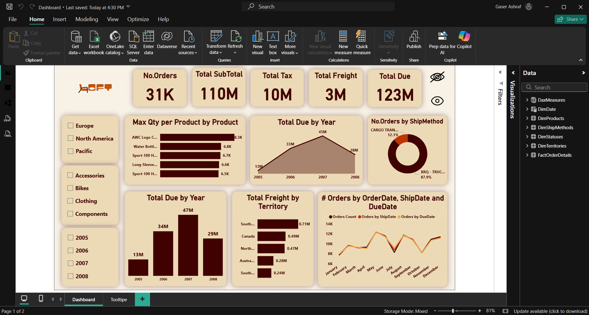
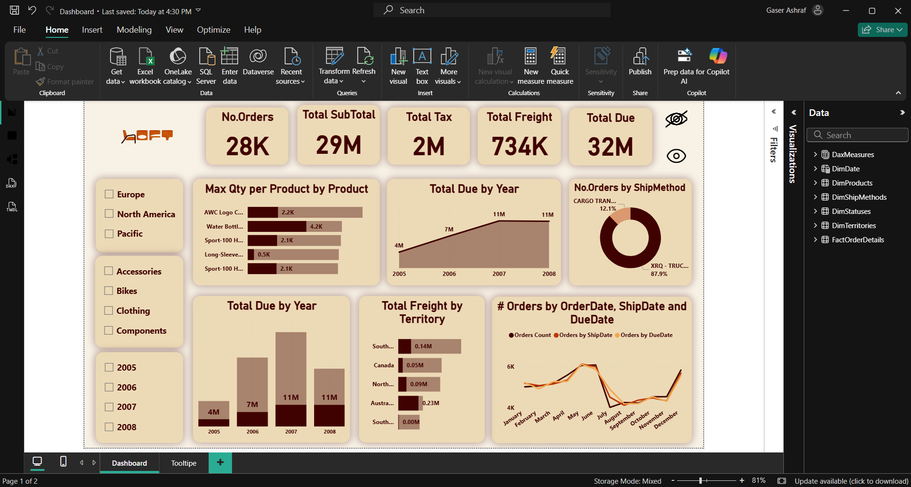
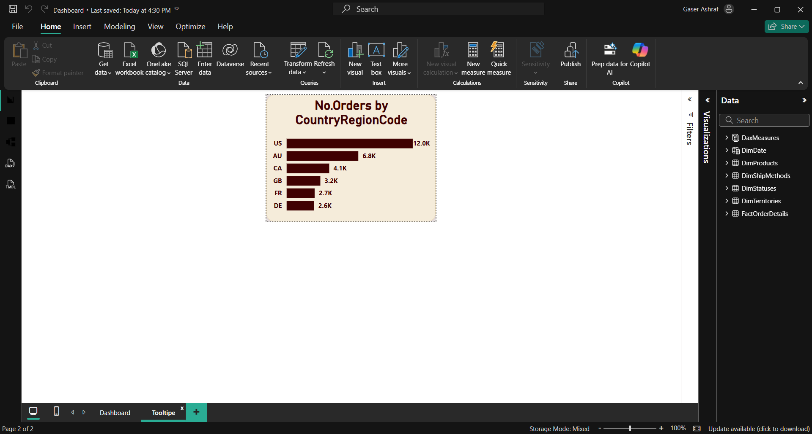
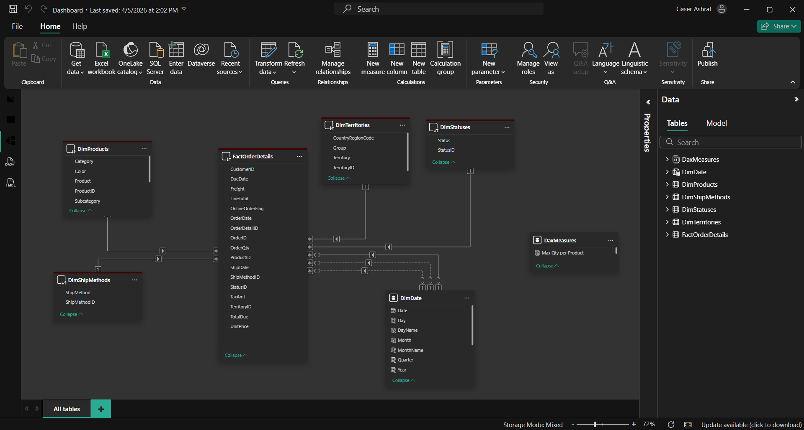

# 🏪 AdventureWorks Sales Dashboard — v2 (Direct Query)

> The same AdventureWorks sales dashboard rebuilt using **Direct Query** connectivity — demonstrating the differences in behavior, performance, and limitations compared to Import Mode.

---

## 📸 Dashboard Preview

| Page               | Screenshot                                  |
| ------------------ | ------------------------------------------- |
| Overview           |     |
| Sales by Territory |       |
| Tooltip            |        |
| Model View         |  |

---

## 📋 Project Details

| Detail                | Value                                                                                                         |
| --------------------- | ------------------------------------------------------------------------------------------------------------- |
| **Data Source**       | SQL Server – AdventureWorks                                                                                   |
| **Connectivity Mode** | ⚡ Direct Query                                                                                               |
| **Schema Type**       | Star Schema                                                                                                   |
| **Source Link**       | [AdventureWorks Install Guide](https://docs.microsoft.com/en-us/sql/samples/adventureworks-install-configure) |

---

## ⚡ Import Mode vs. Direct Query

| Feature                 | v1 — Import       | v2 — Direct Query       |
| ----------------------- | ----------------- | ----------------------- |
| Data stored in Power BI | ✅ Yes            | ❌ No (queries live DB) |
| Query speed             | ⚡ Fast           | 🐢 Depends on DB        |
| Real-time data          | ❌ Manual refresh | ✅ Always current       |
| All DAX supported       | ✅ Full           | ⚠️ Limited              |
| File size               | Larger            | Smaller                 |

---

## 🗂️ Tables Used

| Table                 | Type           |
| --------------------- | -------------- |
| `vw_DimProducts`      | Dimension      |
| `vw_DimSalesPersons`  | Dimension      |
| `vw_DimShipMethods`   | Dimension      |
| `vw_DimStatuses`      | Dimension      |
| `vw_DimTerritories`   | Dimension      |
| `vw_FactOrderDetails` | Fact           |
| `DimDates`            | DAX Date Table |

---

## 📅 DAX Date Table

The `DimDates` table was created using DAX and includes:

- Year
- Month Number
- Month Name
- Day
- Day Name

> ⚠️ In Direct Query mode, DAX-calculated tables are handled differently — the Date table is created in Import mode and related to the Direct Query tables.

---

## 🔗 Data Model

- **Star Schema** with `vw_FactOrderDetails` as the central fact table
- **Product Hierarchy**: Category → Subcategory → Product
- **Date Hierarchy**: Year → Month → Day
- **Role-Playing Dimension** on the Date table using `USERELATIONSHIP()` for:
  - `OrderDate`
  - `ShipDate`
  - `DueDate`

> 📖 Reference: [USERELATIONSHIP in Power BI](https://radacad.com/userelationship-or-role-playing-dimension-dealing-with-inactive-relationships-in-power-bi)

---

## 🧮 DAX Measures

All measures are stored in a dedicated DAX measures table:

| Measure          | Description              |
| ---------------- | ------------------------ |
| `# Orders`       | Count of distinct orders |
| `Total SubTotal` | Sum of order subtotals   |
| `Total Tax`      | Sum of tax amounts       |
| `Total Freight`  | Sum of freight costs     |
| `Total Due`      | Sum of total due amounts |

---

## 📊 Visuals & Features

| Feature                          | Description                                                             |
| -------------------------------- | ----------------------------------------------------------------------- |
| **Drill Down**                   | Hierarchical navigation on product and date dimensions                  |
| **Drill Through**                | Click-through to detailed order/product pages                           |
| **Bookmarks**                    | Toggle button to switch between two charts (show/hide)                  |
| **Max Qty per Product**          | Visual showing maximum quantity ordered per product                     |
| **Matrix Chart**                 | Rows: Territories · Columns: Years · Values: Total Sales + Canada Sales |
| **Synced Slicers**               | Slicers synced across two report pages                                  |
| **Q&A Visual**                   | Natural language question & answer chart                                |
| **Line Chart (USERELATIONSHIP)** | Counts compared across OrderDate, ShipDate, DueDate                     |

---

## 🚀 How to Run

1. Install [Power BI Desktop](https://powerbi.microsoft.com/desktop/)
2. Restore the AdventureWorks database on your local SQL Server instance
3. Open `AdventureWorks_v2.pbix`
4. Update the data source connection to point to your SQL Server
5. Since this is Direct Query, data loads live — no manual refresh needed
