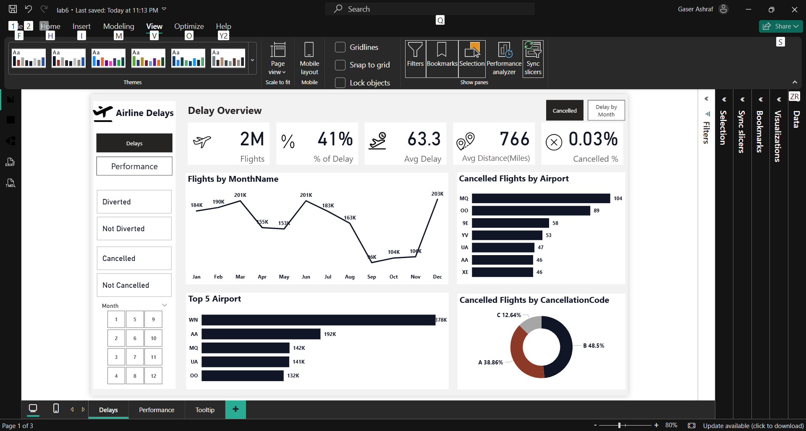
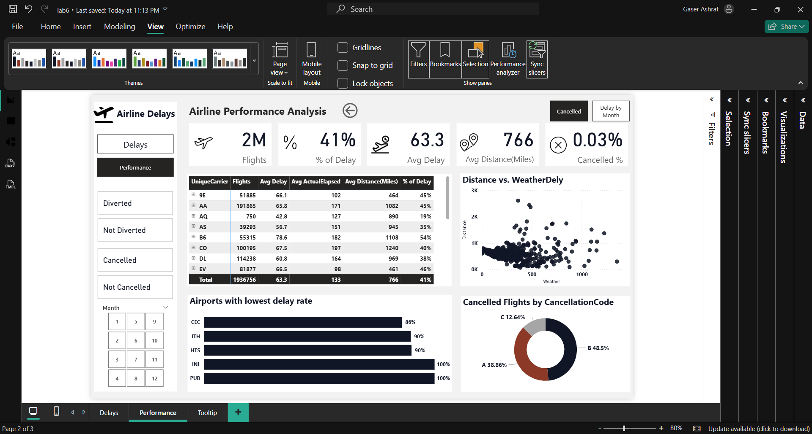
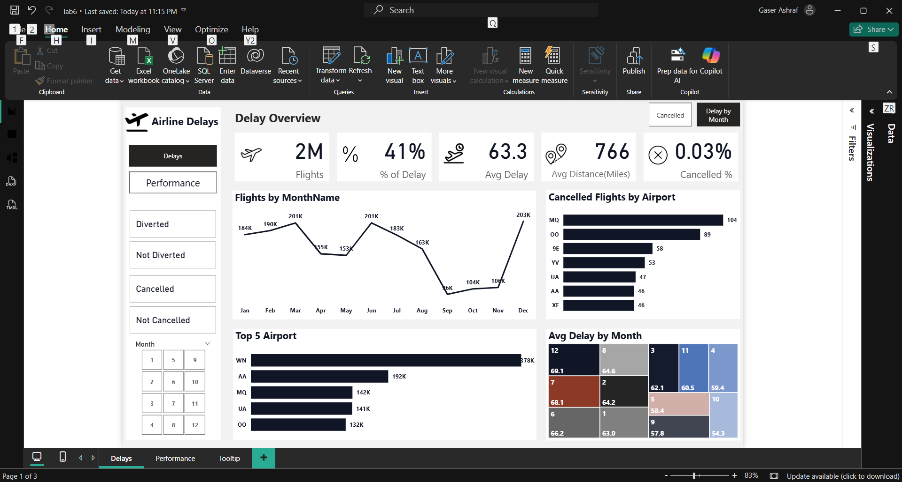
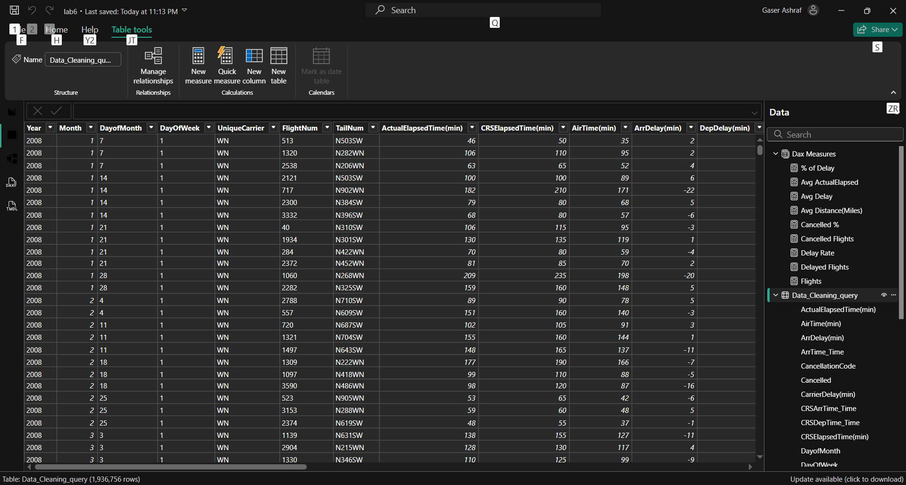

# ✈️ Flight Delays & Cancellations Dashboard

> An end-to-end analytics project combining **Python data cleaning** with an interactive **Power BI dashboard** to analyze flight delay patterns, cancellation causes, and airline performance across U.S. domestic routes.

---

## 📸 Dashboard Preview

| Page                     | Screenshot                                                    |
| ------------------------ | ------------------------------------------------------------- |
| Delay Overview           |                   |
| Airline Performance      |  |
| Drill Through & Bookmark |                        |
| Tooltip                  |                          |
| Table View               |                     |

---

## 📋 Project Details

| Detail                | Value                                    |
| --------------------- | ---------------------------------------- |
| **Data Source**       | U.S. Flight Delay Dataset (Kaggle)       |
| **Connectivity Mode** | Import                                   |
| **Preprocessing**     | Python (Pandas, NumPy, Matplotlib)       |
| **Report Pages**      | 3 pages (Delays · Performance · Tooltip) |

---

## 🐍 Part 1 — Python Data Cleaning

Before building the dashboard, the raw CSV dataset was cleaned using a Jupyter Notebook (`Data_Cleaning.ipynb`).

### Cleaning Steps

| Step                               | Description                                                                          |
| ---------------------------------- | ------------------------------------------------------------------------------------ |
| **1. Import & Load**               | Loaded raw CSV; inspected shape and first rows                                       |
| **2. Missing Values & Duplicates** | Calculated null % per column; identified duplicate rows                              |
| **3. Fill & Fix**                  | Filled missing values with median/mode; converted date/time columns to correct types |
| **4. Feature Engineering**         | Extracted hour, day of week, month, season; added binary `delayed` flag              |
| **5. Filter Outliers**             | Removed rows with negative delay times; renamed columns for clarity                  |
| **6. Final Quality Check**         | Confirmed zero nulls, correct dtypes, and reasonable summary statistics              |

### Output

A clean CSV file (`DelayedFlights_Cleaning_V2.csv`) saved and loaded into Power BI.

---

## 📊 Part 2 — Dashboard Pages

### Page 1 — Delay Overview

Key KPIs at a glance:

- Total Flights
- % of Flights Delayed
- Average Delay (minutes)
- % Cancelled
- Flights by Month/Name
- Top 5 Airports
- Cancelled Flights by Airport & Cancellation Code

### Page 2 — Airline Performance

Detailed airline comparison:

- Unique Carrier breakdown (Flights, Avg Delay, Avg ActualElapsed, Avg Distance, % of Delay)
- Airports with lowest delay rate
- Distance vs. Weather Delay scatter
- Cancelled Flights by Cancellation Code

### Page 3 — Tooltip Page

- Delay Rate by Origin (used as a custom tooltip on visuals)

---

## 🧮 DAX Measures

All measures are stored in a dedicated `Dax Measures` table:

| Measure                | Description                         |
| ---------------------- | ----------------------------------- |
| `Flights`              | Total number of flights             |
| `Delayed Flights`      | Count of flights with delay > 0     |
| `Cancelled Flights`    | Count of cancelled flights          |
| `% of Delay`           | Delayed flights / Total flights     |
| `Cancelled %`          | Cancelled flights / Total flights   |
| `Avg Delay`            | Average arrival delay in minutes    |
| `Avg ActualElapsed`    | Average actual elapsed time         |
| `Avg Distance (Miles)` | Average flight distance             |
| `Delay Rate`           | Delay rate metric for normalization |

---

## 📊 Visuals & Features

| Feature           | Description                                              |
| ----------------- | -------------------------------------------------------- |
| **KPI Cards**     | Total flights, % delayed, avg delay, % cancelled         |
| **Bar Charts**    | Delay causes ranked by total minutes; airline comparison |
| **Line Chart**    | Delays and cancellations over time (by month)            |
| **Matrix**        | Avg delay by month grid                                  |
| **Scatter Plot**  | Distance vs. Weather Delay                               |
| **Donut Chart**   | Cancellation codes breakdown                             |
| **Drill Through** | Drill into specific airline or airport details           |
| **Bookmarks**     | Toggle between Cancelled view and Delay by Month view    |
| **Tooltip Page**  | Custom tooltip showing Delay Rate by Origin              |

---

## 🔑 Key Findings

- **Late aircraft** is the single biggest driver of delays
- **Summer months** and **morning peak hours** see the highest delay rates
- **Weather delays** are less frequent but cause the longest average delay time
- There is a **wide performance gap** between airlines
- Clean and organized data made dashboard insights significantly more reliable

---

## 🚀 How to Run

1. Install [Power BI Desktop](https://powerbi.microsoft.com/desktop/)
2. (Optional) Run `Data_Cleaning.ipynb` in Jupyter to reproduce the clean dataset
3. Open `Airline_Delays.pbix`
4. If needed, update the CSV file path in Power Query to point to your local `DelayedFlights_Cleaning_V2.csv`
5. Click **Refresh**
