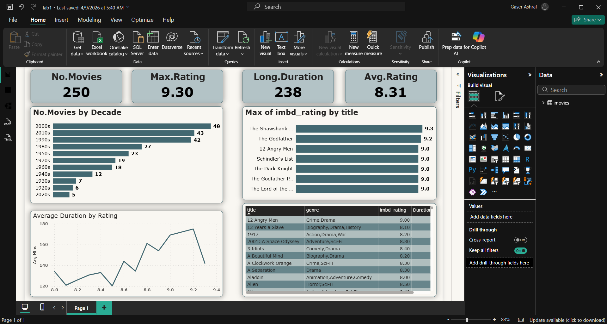
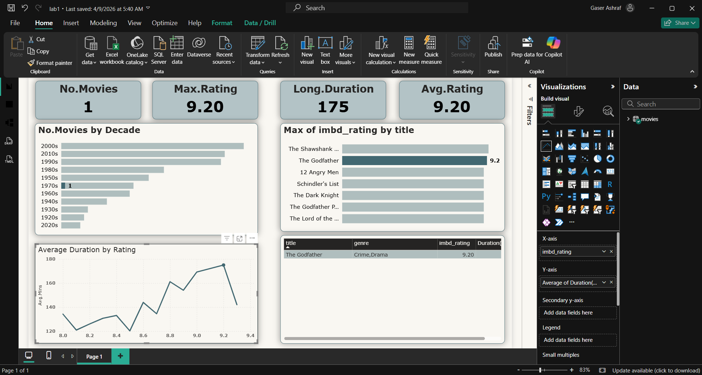
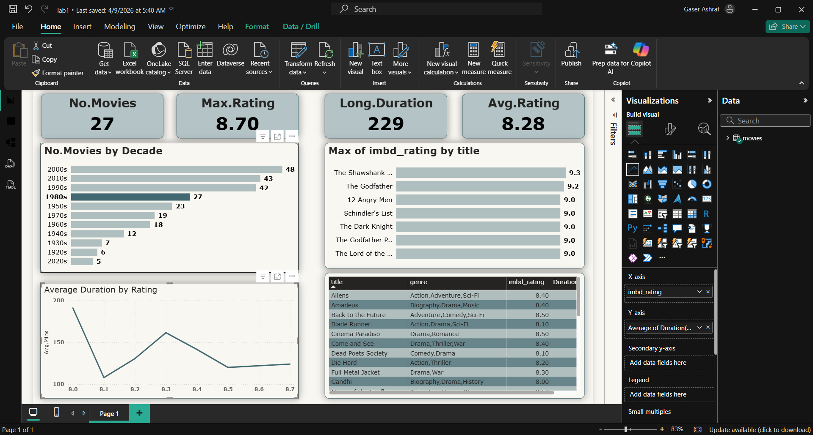
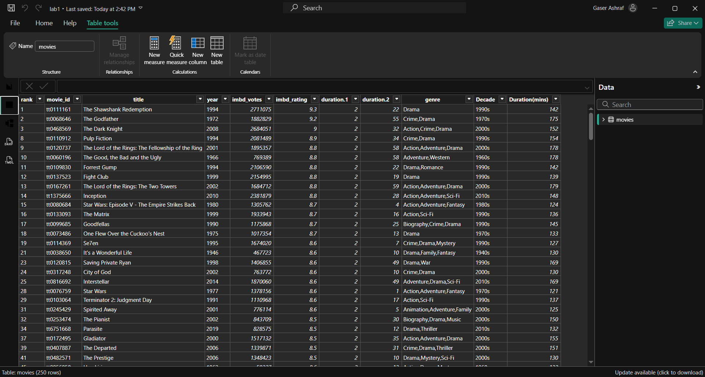
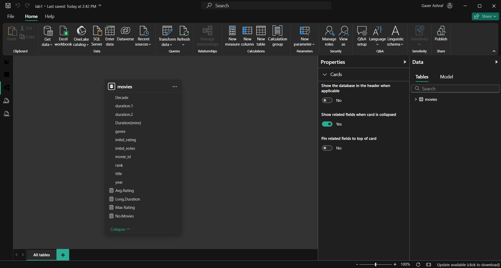

# 🎬 Top 250 Movies — IMDb Dashboard

> An analytics dashboard exploring the IMDb Top 250 movies, analyzing ratings, genres, decades, and duration trends using Power BI.

---

## 📸 Dashboard Preview

| Page             | Screenshot                       |
| ---------------- | -------------------------------- |
| Overview         |  |
| Ratings by Genre |     |
| Movies by Decade |    |
| Table View       |     |
| Model View       |     |

---

## 📋 Project Details

| Detail                | Value                |
| --------------------- | -------------------- |
| **Data Source**       | IMDb Top 250 Dataset |
| **Connectivity Mode** | Import               |
| **Total Movies**      | 250                  |

---

## 📊 Dashboard KPIs

| KPI Card             | Value    |
| -------------------- | -------- |
| **No. Movies**       | 250      |
| **Max Rating**       | 9.30     |
| **Longest Duration** | 238 mins |
| **Avg Rating**       | 8.31     |

---

## 📈 Visuals & Features

| Visual         | Description                                                                 |
| -------------- | --------------------------------------------------------------------------- |
| **KPI Cards**  | No. Movies · Max Rating · Long Duration · Avg Rating                        |
| **Bar Chart**  | No. Movies by Decade (1920s → 2020s)                                        |
| **Bar Chart**  | Max IMDb Rating by Title (Top-rated films)                                  |
| **Line Chart** | Average Duration by Rating (trend: how rating correlates with movie length) |
| **Table**      | Detailed table: Title · Genre · IMDb Rating · Duration                      |

---

## 🔍 Sample Insights

- **2000s** produced the most Top 250 movies (48 films)
- **The Shawshank Redemption** holds the highest rating at **9.3**
- Higher-rated movies (9.0+) tend to have **longer runtimes**
- Classic decades (1940s–1960s) are well-represented despite fewer releases

---

## 🎬 Top Rated Movies Preview

| Title                    | Genre                     | IMDb Rating |
| ------------------------ | ------------------------- | ----------- |
| The Shawshank Redemption | Drama                     | 9.3         |
| The Godfather            | Crime, Drama              | 9.2         |
| 12 Angry Men             | Crime, Drama              | 9.0         |
| Schindler's List         | Biography, Drama, History | 9.0         |
| The Dark Knight          | Action, Crime, Drama      | 9.0         |

---

## 🚀 How to Run

1. Install [Power BI Desktop](https://powerbi.microsoft.com/desktop/)
2. Open `Top250_Movies.pbix`
3. Click **Refresh** if prompted to reload data
