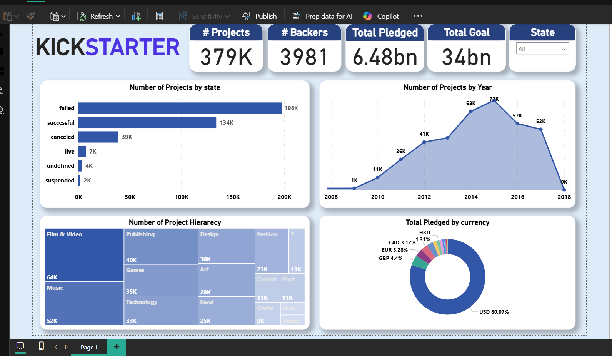
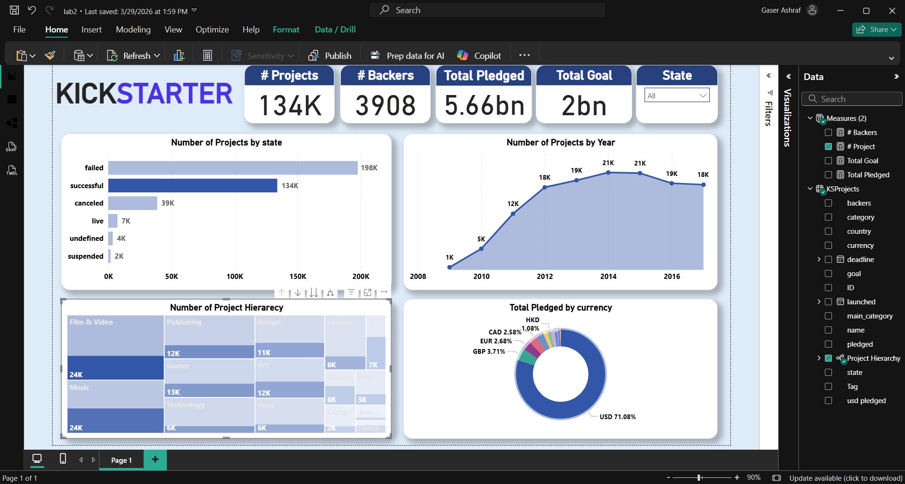
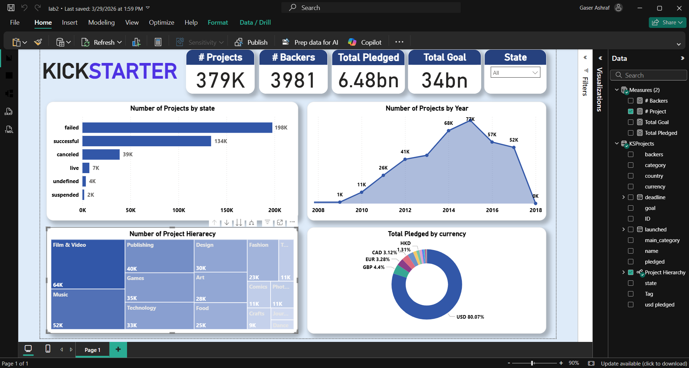
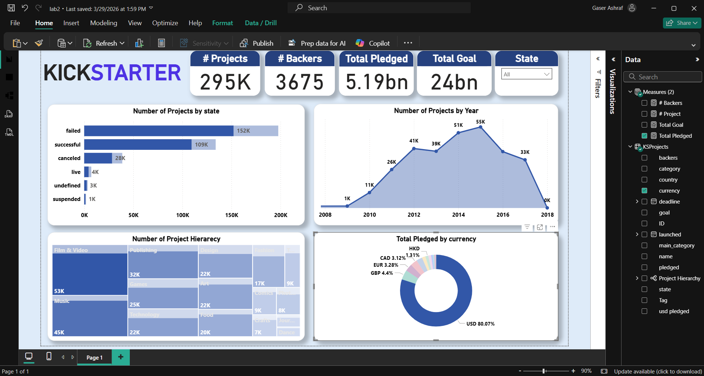

# 🚀 Kickstarter Projects Dashboard

> An analytics dashboard exploring crowdfunding trends from Kickstarter's 2016 and 2018 datasets. Built with Power Query data transformation (M Language), custom hierarchies, and interactive visuals.

---

## 📸 Dashboard Preview

| Page                 | Screenshot                           |
| -------------------- | ------------------------------------ |
| Overview             |     |
| Projects by State    |  |
| Projects by Category |   |
| Pledged by Currency  |   |

---

## 📋 Project Details

| Detail                | Value                                                                 |
| --------------------- | --------------------------------------------------------------------- |
| **Data Source**       | Kaggle — Kickstarter Projects (CSV)                                   |
| **Connectivity Mode** | Import                                                                |
| **Files Used**        | `ks-projects-201612.csv` (2016) + `ks-projects-201801.csv` (2018)     |
| **Source Link**       | [Kaggle Dataset](https://www.kaggle.com/kemical/kickstarter-projects) |

---

## 🔄 Data Transformation (Power Query / M Language)

| Step               | Description                                                                        |
| ------------------ | ---------------------------------------------------------------------------------- |
| **Custom Column**  | Added a column with the source file name (e.g., `2016` or `2018`) using M Language |
| **Append (Union)** | Combined both CSV files into a single table using M Language (not the UI)          |
| **Table Rename**   | Renamed the merged table to `KSProjects`; hid/removed intermediate tables          |

### Append Result Structure

```
2016 file  +  2018 file
      ↓
  KSProjects  (combined)
```

---

## 🔗 Data Model

- **Project Hierarchy**: Main Category → Category → Project Name
- Measures table created to hold all KPI measures
- Unused/intermediate tables hidden from report view

---

## 🧮 DAX Measures

| Measure         | Description             |
| --------------- | ----------------------- |
| `# Projects`    | Count of all projects   |
| `# Backers`     | Total number of backers |
| `Total Pledged` | Sum of pledged amounts  |
| `Total Goal`    | Sum of goal amounts     |

---

## 📊 Visuals & Features

| Visual                | Description                                                               |
| --------------------- | ------------------------------------------------------------------------- |
| **KPI Cards**         | # Projects · # Backers · Total Pledged · Total Goal                       |
| **Bar Chart**         | # Projects by State (successful, failed, cancelled, etc.)                 |
| **Drill Down Chart**  | # Projects by Project Hierarchy (Main Category → Category → Project Name) |
| **Line / Area Chart** | # Projects by Launch Date (trend over time)                               |
| **Bar / Map Chart**   | Total Pledged by Currency or Country                                      |

---

## 🚀 How to Run

1. Install [Power BI Desktop](https://powerbi.microsoft.com/desktop/)
2. Download the Kickstarter CSVs from [Kaggle](https://www.kaggle.com/kemical/kickstarter-projects)
3. Open `Kickstarter.pbix`
4. Update the CSV file paths in Power Query to point to your local files
5. Click **Refresh**
